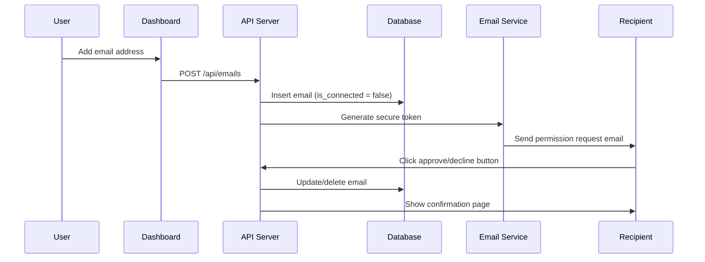

# Secure Email Approval/Decline System

## Overview

The Numenor Security platform implements a secure email approval/decline system that allows email recipients to grant or deny permission for their email addresses to be monitored for security threats. This system ensures that only authorized individuals can approve monitoring requests while maintaining strong security controls.

## Architecture

### Components

1. **Email Service** (`app/api/utils/emailService.ts`)
   - Generates permission request emails
   - Embeds secure tokens in email templates
   - Handles email delivery

2. **Token Service** (`app/api/utils/tokenService.ts`)
   - Generates cryptographically secure tokens
   - Validates token authenticity and expiration
   - Implements HMAC-SHA256 security

3. **Modular API Structure**
   - **Main Router** (`app/api/routes/emails.ts`) - Composes all email modules
   - **Email Management** (`app/api/routes/email-management.ts`) - CRUD operations
   - **Email Approval** (`app/api/routes/email-approval.ts`) - Approval/decline endpoints
   - **Email Actions** (`app/api/routes/email-actions.ts`) - Actions and statistics

4. **API Endpoints**
   - `POST /api/emails/:id/approve` - Approve email monitoring (returns HTML)
   - `POST /api/emails/:id/decline` - Decline email monitoring (returns HTML)
   - `GET /api/emails/` - List monitored emails
   - `POST /api/emails/` - Add new email
   - `PUT /api/emails/:id` - Update email
   - `DELETE /api/emails/:id` - Remove email
   - `POST /api/emails/:id/resend` - Resend permission email
   - `GET /api/emails/stats` - Get email statistics

5. **HTML Response Pages** (integrated in `email-approval.ts`)
   - Returns user-friendly HTML pages for approval/decline
   - Displays confirmation messages with business and email details
   - Includes close window functionality

## Security Features

### 1. Cryptographic Token System

#### Token Generation
```typescript
generateApprovalToken(emailId: number, businessId: number): string {
  const payload = `approve_${emailId}_${businessId}_${Date.now()}`;
  const secret = process.env.TOKEN_SECRET;
  const hash = crypto.createHmac('sha256', secret).update(payload).digest('hex');
  return `${payload}_${hash}`;
}
```

#### Token Structure
- **Action**: `approve` or `decline`
- **Email ID**: Unique identifier for the monitored email
- **Business ID**: Business requesting monitoring
- **Timestamp**: Creation time for expiration checking
- **HMAC Hash**: Cryptographic signature for integrity

#### Token Validation
- **Expiration**: Tokens expire after 24 hours
- **Integrity**: HMAC-SHA256 hash verification
- **Ownership**: Validates email belongs to business
- **Uniqueness**: Each token is single-use

### 2. Form-Based Security

#### HTML Form Implementation
```html
<form method="POST" action="/api/emails/123/approve">
  <input type="hidden" name="businessId" value="456">
  <input type="hidden" name="token" value="approve_123_456_1234567890_abc123...">
  <button type="submit">✅ Grant Permission</button>
</form>
```

#### Security Benefits
- **CSRF Protection**: Hidden tokens prevent cross-site attacks
- **POST Requests**: Prevents URL-based exploitation
- **Server Validation**: All tokens validated server-side
- **Duplicate Action Prevention**: Prevents multiple approvals/declines
- **State Validation**: Checks current email status before processing

### 3. Duplicate Action Prevention

#### Protection Against Multiple Actions
The system prevents duplicate or conflicting actions by checking the current state before processing:

**Approval Protection:**
- ✅ **First Approval**: Processes normally, sets `is_connected = true`
- ❌ **Duplicate Approval**: Shows "Already Approved" message, logs attempt
- ❌ **Approval After Decline**: Shows "Already Declined" message, logs attempt

**Decline Protection:**
- ✅ **First Decline**: Processes normally, removes email from monitoring
- ❌ **Duplicate Decline**: Shows "Already Declined" message, logs attempt
- ❌ **Decline After Approval**: Shows "Cannot Decline" message, logs attempt

#### Security Event Logging
All duplicate action attempts are logged for security monitoring:
```sql
-- Duplicate approval attempt
INSERT INTO security_events (business_id, event_type, description, ip_address, user_agent)
VALUES ($1, 'duplicate_approval_attempt', $2, $3, $4);

-- Approval after decline attempt
INSERT INTO security_events (business_id, event_type, description, ip_address, user_agent)
VALUES ($1, 'approval_after_decline_attempt', $2, $3, $4);

-- Decline after approval attempt
INSERT INTO security_events (business_id, event_type, description, ip_address, user_agent)
VALUES ($1, 'decline_after_approval_attempt', $2, $3, $4);
```

### 4. Database Security

#### Approval Process
```sql
-- Verify email ownership
SELECT id, email_address FROM monitored_emails 
WHERE id = $1 AND business_id = $2;

-- Update connection status
UPDATE monitored_emails 
SET is_connected = true, updated_at = CURRENT_TIMESTAMP
WHERE id = $1 AND business_id = $2;

-- Log security event
INSERT INTO security_events (business_id, event_type, description, ip_address, user_agent)
VALUES ($1, 'email_approved', $2, $3, $4);
```

#### Decline Process
```sql
-- Get email info for logging
SELECT id, email_address FROM monitored_emails 
WHERE id = $1 AND business_id = $2;

-- Remove from monitoring
DELETE FROM monitored_emails 
WHERE id = $1 AND business_id = $2;

-- Log security event
INSERT INTO security_events (business_id, event_type, description, ip_address, user_agent)
VALUES ($1, 'email_declined', $2, $3, $4);
```

## Workflow

### 1. Email Addition Process



### 2. Token Lifecycle

1. **Generation**: Created when permission email is sent
2. **Transmission**: Embedded in email as hidden form field
3. **Validation**: Verified when user submits form
4. **Expiration**: Automatically expires after 24 hours
5. **Single Use**: Each token can only be used once

### 3. Security Validation Chain

```
User Action → Token Validation → Business Verification → Database Update → Audit Log
```

## API Endpoints

### POST /api/emails/:id/approve

**Purpose**: Approve email monitoring request

**Request Body**:
```json
{
  "businessId": 123,
  "token": "approve_456_123_1234567890_abc123..."
}
```

**Response**:
```json
{
  "message": "Email monitoring approved successfully",
  "emailAddress": "user@example.com"
}
```

**Security Checks**:
- Token format validation
- HMAC signature verification
- Expiration time checking
- Business ownership verification
- Email existence validation

### POST /api/emails/:id/decline

**Purpose**: Decline email monitoring request

**Request Body**:
```json
{
  "businessId": 123,
  "token": "decline_456_123_1234567890_def456..."
}
```

**Response**:
```json
{
  "message": "Email monitoring declined successfully",
  "emailAddress": "user@example.com"
}
```

**Security Checks**:
- Same validation as approve endpoint
- Additional confirmation for deletion

## Email Template

### HTML Version
```html
<div style="text-align: center; margin: 30px 0;">
  <form method="POST" action="https://api.numenorsecurity.com/api/emails/123/approve">
    <input type="hidden" name="businessId" value="456">
    <input type="hidden" name="token" value="approve_123_456_1234567890_abc123...">
    <button type="submit" style="background-color: #10b981; color: white; padding: 12px 24px; border-radius: 6px;">
      ✅ Grant Permission
    </button>
  </form>
  
  <form method="POST" action="https://api.numenorsecurity.com/api/emails/123/decline">
    <input type="hidden" name="businessId" value="456">
    <input type="hidden" name="token" value="decline_123_456_1234567890_def456...">
    <button type="submit" style="background-color: #dc2626; color: white; padding: 12px 24px; border-radius: 6px;">
      ❌ Deny Permission
    </button>
  </form>
</div>
```

### Text Version
```
To respond, please visit one of these secure links:
- Grant Permission: https://api.numenorsecurity.com/api/emails/123/approve 
  (POST with businessId: 456, token: approve_123_456_1234567890_abc123...)
- Deny Permission: https://api.numenorsecurity.com/api/emails/123/decline 
  (POST with businessId: 456, token: decline_123_456_1234567890_def456...)
```

## Security Considerations

### 1. Token Security

**Strengths**:
- HMAC-SHA256 cryptographic signatures
- Time-based expiration (24 hours)
- Unique per request
- Server-side validation only

**Protections**:
- Prevents token forgery
- Limits exposure window
- Prevents replay attacks
- Ensures server control

**24-Hour Expiration Rationale**:
- **Security**: Minimizes attack window if email is compromised
- **Business Context**: Covers standard business hours + overnight
- **User Experience**: Provides reasonable time for decision-making
- **Risk Management**: Balances security with usability
- **Industry Standard**: Aligns with common email security practices

### 2. Input Validation

**Parameter Validation**:
```typescript
if (!businessId || !token) {
  return res.status(400).json({ error: 'Missing required parameters' });
}

if (!tokenService.validateApprovalToken(token, parseInt(emailId), businessId)) {
  return res.status(403).json({ error: 'Invalid or expired approval token' });
}
```

**Database Validation**:
```sql
SELECT id, email_address FROM monitored_emails 
WHERE id = $1 AND business_id = $2;
```

### 3. Audit Logging

**Security Events**:
- `email_approved`: Successful approval
- `email_declined`: Successful decline
- `permission_email_sent`: Email sent
- `permission_email_resent`: Email resent

**Logged Information**:
- Business ID
- Email address
- IP address
- User agent
- Timestamp
- Action type

## Configuration

### Environment Variables

```bash
# Token Security
TOKEN_SECRET=your-64-character-hex-secret-key

# Email Configuration
SMTP_HOST=smtp.gmail.com
SMTP_PORT=587
SMTP_USER=your-email@gmail.com
SMTP_PASS=your-app-password
SMTP_FROM=Numenor Security <your-email@gmail.com>

# API Configuration
API_BASE_URL=https://api.numenorsecurity.com
```

### Token Secret Generation

```bash
# Generate secure token secret
openssl rand -hex 32
```

## Error Handling

### Common Error Responses

**Invalid Token**:
```json
{
  "error": "Invalid or expired approval token"
}
```

**Missing Parameters**:
```json
{
  "error": "Missing required parameters"
}
```

**Email Not Found**:
```json
{
  "error": "Email not found"
}
```

**Business Not Found**:
```json
{
  "error": "Business not found"
}
```

## Best Practices

### 1. Token Management
- Use strong, random TOKEN_SECRET
- Rotate secrets regularly
- Monitor token usage patterns
- Implement rate limiting

### 2. Email Security
- Use HTTPS for all communications
- Implement SPF, DKIM, DMARC
- Monitor email delivery rates
- Handle bounce notifications

### 3. Database Security
- Use parameterized queries
- Implement connection pooling
- Regular security audits
- Backup and recovery procedures

### 4. Monitoring
- Log all security events
- Monitor failed token validations
- Track approval/decline rates
- Alert on suspicious activity

## Troubleshooting

### Common Issues

**Token Expired**:
- Check system time synchronization
- Verify TOKEN_SECRET consistency
- Review token generation timestamp

**Email Not Delivered**:
- Verify SMTP configuration
- Check spam filters
- Validate email addresses
- Monitor delivery logs

**Database Errors**:
- Check connection strings
- Verify table permissions
- Review query syntax
- Monitor database logs

### Debug Mode

Enable debug logging by setting:
```bash
NODE_ENV=development
DEBUG=numenor:email:*
```

## Future Enhancements

### Planned Improvements

1. **Rate Limiting**: Implement request rate limiting
2. **Token Rotation**: Shorter expiration times
3. **Multi-Factor**: Additional verification steps
4. **Analytics**: Approval/decline analytics
5. **Notifications**: Real-time status updates

### Security Roadmap

1. **OAuth Integration**: Support for OAuth providers
2. **Blockchain Tokens**: Immutable token records
3. **Zero-Knowledge**: Privacy-preserving validation
4. **Quantum Resistance**: Post-quantum cryptography

## Conclusion

The secure email approval/decline system provides a robust, cryptographically secure method for managing email monitoring permissions. By implementing HMAC-SHA256 tokens, form-based security, and comprehensive validation, the system ensures that only authorized individuals can approve monitoring requests while maintaining strong security controls and audit trails.

The system is designed to be:
- **Secure**: Cryptographic token validation
- **User-Friendly**: Simple one-click approval/decline
- **Auditable**: Comprehensive logging
- **Scalable**: Efficient database operations
- **Maintainable**: Clean, well-documented code
